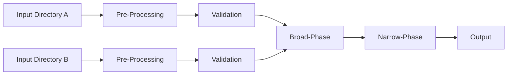

# k8s-diff

TL;DR:

> This tool produces clean diffs that include only relevant information between two sets of kubernetes manifests. 
> It does this by selectively ignoring and patching away uninteresting differences by using a flexible configuration format based on [JsonPatches](#note-about-jsonpatchoperations). 
> It also helps you maintain these patches overtime and prevent them from becoming stale.

This is a tool for comparing two **local** sets of kubernetes manifests.

Many tools exist for comparing local files against a running kubernetes API server - that's not what this tool does.
Instead, this tool is meant to compare two sets of kubernetes files stored locally on your computer.
This is useful when comparing two different methods of deploying an application to kubernetes.
For example in the case of Grafana Labs, we publish both Helm and Jsonnet for deploying our backend database, Grafana Mimir.

## Motivation

Directly comparing `tanka export` output to `helm template` output imposes several challenges:

1. Resources may be named differently, but otherwise identical.
   - e.g. A StatefulSet called `mimir-ingester` (Helm) vs `ingester` (Jsonnet)
2. Resource defaults may be explicitly defined by one set of manifests despite having no impact on the final state
   - e.g. setting `initContainers: []` in a PodTemplaceSpec.
3. Some differences may not be of interest to you
   - e.g. the `helm.sh/chart` label common in Helm charts doesn't really make sense in Jsonnet

Lastly, there may be so many differences that it's not reasonable to fix them all at once. 
Instead, this tool allows you to fix differences _incrementally_.

## How it works

Internally, k8s-diff has four main phases as indicated in the diagram below.

1. Preprocessing
    - During this phase, manifests are modified in order to eliminate superfluous differences that are deemed unimportant by the user
2. Validation
    - During this phase, debug information collected during preprocessing is used to validate that all rules defined in the config file actually impact the final output.
3. Broad-Phase Comparison
    - Durring this phase, basic set comparison is performed to identify objects that are entirely missing from either set of inputs
4. Narrow-Phase Comparison
    - Durring this phase, objects that exist in both sets are directly compared and a text-based diff tool is used to display useful output



## Usage

```
Usage of k8s-diff:
  -dir-a string
    	Directory to read left state from
  -dir-b string
    	Directory to read right state from
  -rules value
    	Rule file to load, can be specified multiple times
```

A typical invocation might look like this:

```
k8s-diff -dir-a input-dir-a -dir-b input-dir-b \
     -rules renames.yml \
     -rules ignored_fields.yml 
```

## Rule File Format

Rule files can be specified multiple times via the `-rules` flag. Rules across all files are collected and run in the following order

1. Ignore rules from all files, in the order specified
2. Server-side defaults
3. Patch rules from all files, in the order specified

Below is an example rule file that ignores all objects with `kind: Secret` and ignores annotations across all objects.

```
---
ignore_rules:
- name: "Ignore all secrets"
  match:
  - op: test
    path: /kind
    value: Secret

patch_rules:
- remove_field: /metadata/annotations
```

All rules have a `name` and `match` field. See below for detailed notes about available fields on each rule.


### Ignore Rules

Ignore rules are used to completely remove any object from the output.

Ignore rules have the following structure:

```
- name: string
  match: []JsonPatchOperation
```

- `name` is meant for documentation only. It is used in the program output to communicate issues to the user.
- `match` is a [JsonPatch](#note-about-jsonpatch) value. If the patch can be successfully applied to a given object, then that object is said to "match" the ignore rule. Any objects matching the ignore rule are filtered from the output entirely. An empty `match` section will match every object.

### Patch Rules

Patch rules are used to modify objects before the final diff is computed. 
This is most commonly used to rename objects or alter their fields such that the rendered diff only contains relevant information.

Patch rules have the following structure:

```
- name: string
  match: []JsonPatchOperation (optional)
  steps: []JsonPatchOperation
  match_kind: string (optional), kubernetes Kind (e.g. Secret)
  remove_field: string (optional), field name in jsonpatch notation (e.g. /metadata/labels/name)
  rename_object: (optional)
    from: string, name to replace in /metadata/name
    to: string, target name
  rename_field: (optional)
    from: string, field name in jsonpatch notation (e.g. /metadata/labels/name)
    to: string, field name in jsonpatch notation (e.g. /metadata/labels/name)
```

- `name` is meant for documentation only. It is used in the program output to communicate issues to the user.
- `match` is a [JsonPatch](#note-about-jsonpatchoperations) value. If the patch can be successfully applied to a given object, then that object is said to "match" the patch rule. An empty `match` section will match every object.
- `steps` is a [JsonPatch](#note-about-jsonpatchoperations) value. Any objects matching the patch rule will have this JsonPatch applied to them.

The `match_kind`, `remove_field`, `rename_object`, and `rename_field` properties are all shorthand for various JsonPatchOperations. A desugaring step before rule application converts these fields into additional items in one or both of the `match` and `steps` fields. They are provided as convenient shorthands to reduce noise in the rules files. When using one of `remove_field`, `rename_object`, or `rename_field`, the `name` is optional. It will be generated according to the relevant shorthand if absent.

- `match_kind` adds an additional `test` operation to the `match` section.
- `remove_field` adds an additional `remove` operation to both the `match` and `steps` section. Adding the `remove` operation to the `match` section ensures that the rule only applies to objects that actually have that property.
- `rename_object` adds an additional `test` operation to the `match` section and an additional `replace` operation to the `steps` section. The end result is that any object where the `/metadata/name` field matches `rename_object.from` will be renamed to `rename_object.to`
- `rename_field` adds an additional `remove` operation to the `match` section and an additional `move` operation to the `steps` section. The end result is that any object containing a value in the field denoted by `rename_field.from` will have that value moved to the field denoted by `rename_field.to`. This is useful to rename labels for example.
### Note about JsonPatchOperations

Both the `match` and `steps` fields are of type []JsonPatchOperation. 
This refers to [RFC 6902](https://tools.ietf.org/html/rfc6902). 
This is the same patch description system used by [kustomize](https://kustomize.io/).
