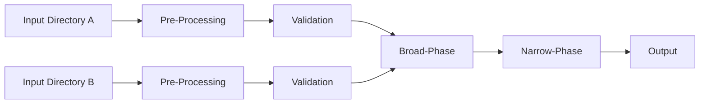

# k8s-diff

This is a tool for comparing two **local** sets of kubernetes manifests.

Many tools exist for comparing local files against a running kubernetes API server - that's not what this tool does.
Instead, this tool is meant to compare two sets of kubernetes files stored locally on your computer.
This is useful when comparing two different methods of deploying an application to kubernetes.
For example in the case of Grafana Labs, we publish both Helm and Jsonnet for deploying our backend database, Grafana Mimir.

## Motivation

Directly comparing `tanka export` output to `helm template` output imposes several challenges:

1. Resources may be named differently, but otherwise identical.
   - e.g. A StatefulSet called `mimir-ingester` (Helm) vs `ingester` (Jsonnet)
2. Resource defaults may be explicitly defined by one set of manifests despite having no impact on the final state
   - e.g. setting `initContainers: []` in a PodTemplaceSpec.
3. Some differences may not be of interest to you
   - e.g. the `helm.sh/chart` label common in Helm charts doesn't really make sense in Jsonnet

Lastly, there may be so many differences that it's not reasonable to fix them all at once. 
Instead, this tool allows you to fix differences _incrementally_.

## How it works

Internally, k8s-diff has four main phases as indicated in the diagram below.

1. Preprocessing
    - During this phase, manifests are modified in order to eliminate superfluous differences that are deemed unimportant by the user
2. Validation
    - During this phase, debug information collected during preprocessing is used to validate that all rules defined in the config file actually impact the final output.
3. Broad-Phase Comparison
    - Durring this phase, basic set comparison is performed to identify objects that are entirely missing from either set of inputs
4. Narrow-Phase Comparison
    - Durring this phase, objects that exist in both sets are directly compared and a text-based diff tool is used to display useful output



## Usage

```
Usage of k8s-diff:
  -dir-a string
    	Directory to read left state from
  -dir-b string
    	Directory to read right state from
  -rules value
    	Rule file to load, can be specified multiple times
```

A typical invocation might look like this:

```
k8s-diff -dir-a input-dir-a -dir-b input-dir-b \
     -rules renames.yml \
     -rules ignored_fields.yml 
```
